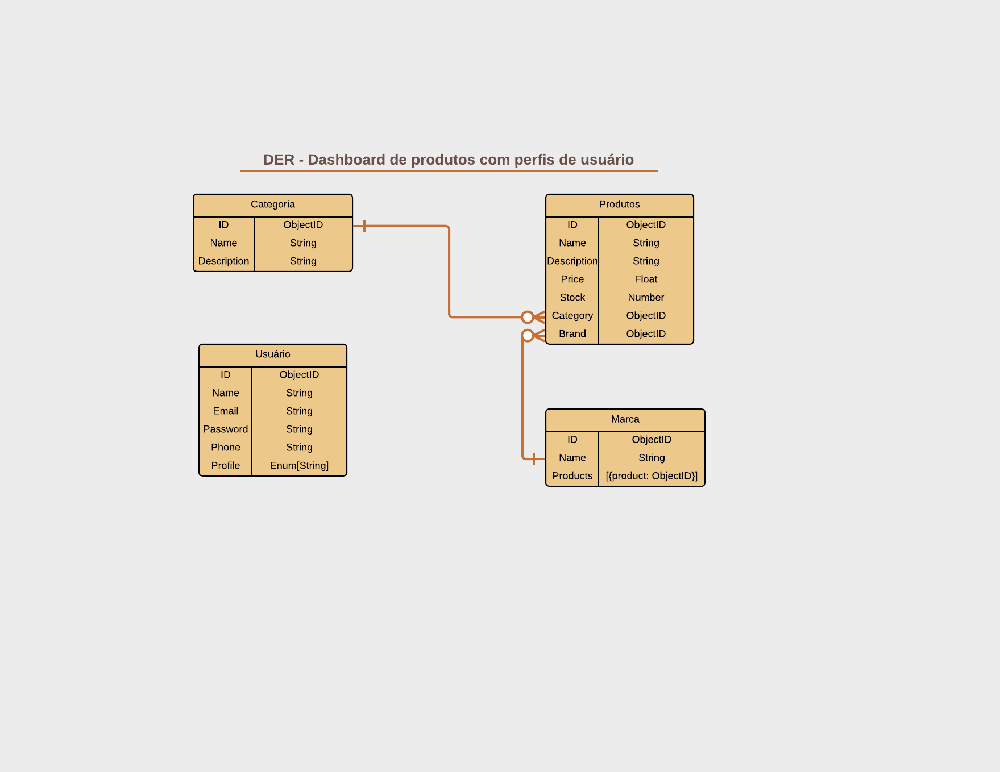
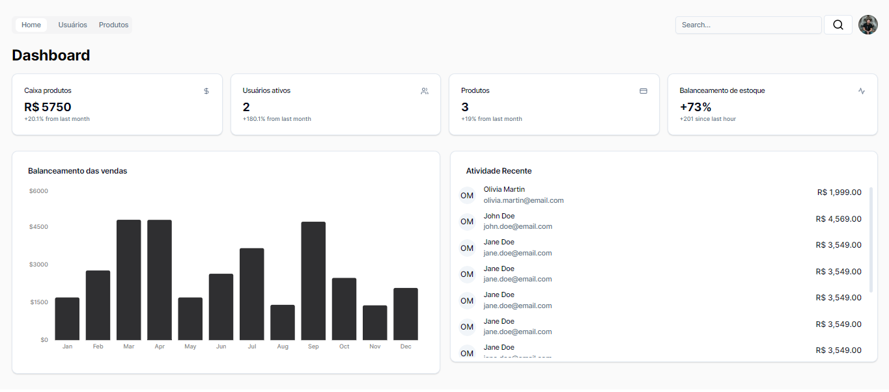

# DASHBOARD DE CONTROLE DE PRODUTOS E ESTOQUE, COM MARCAS, CATEGORIAS, E PERFIS DE USUÁRIOS, PARA DIFERENTES NIVEIS DE ACESSO NO SISTEMA.

## Sobre

Desenvolvida com Nodejs e Typescript e a persistência dos dados no MongoDB. Consta também com o padrão de projeto Repository Pattern e Services em sua arquitetura.
O Frontend foi desenvolvido com Next14 e componentes do ShadcnUI

### 📋 Lista de features

- [x] Perfis de usuários
- [x] Cadastro/Login de usuários
- [x] Filtragem na Listagem de Produtos pela Marca e/ou Categoria
- [x] Persistência em Banco de Dados
- [x] Middlewares para controle da Autenticação e Autorização de acesso à rotas com base no Perfil do usuário.
- [x] Repository Pattern
- [x] Principios de Injeção de Dependências & Inversão de Dependências.

### 🗺️​ Rotas da API

- [x] "/": Rota inicial de apresentação
- [x] GET "/users": Lista todos Usuários
- [x] GET "/products": Lista todos Produtos
- [x] GET "/products?brand=<brandID>": Lista todos Produtos com a Query especificada
- [x] GET "/brands?name=<Name>": Pesquisa uma Marca com a Query especificada
- [x] POST "/login": Autentica o usuário

**Detalhe Importante:** As demais requisições HTTP (PUT/PATCH, POST & DELETE) também são a partir da mesma rota do GET de cada modulo, mudando apenas o verbo HTTP.

### 📈 DER



### 💻 FRONTEND




### 🔧 Instalação

Na raiz do projeto e também em cada pasta API e WEB, instale as dependências do projeto:

```
npm install
```

Em seguida se quiser rodar a aplicação completa, pode usar o comando abaixo na raiz do projeto

```
npm run start
```

Ou então também é possivel rodar só a API ou só o Front Web com o comando (dentro pasta):

```
npm run dev
```

### 💭​ Observações

De acordo com a regra de negócio para o dominio escolhido, é possivel a implementação de novas features bem como a refatoração das features existentes.

## ✒️ Autor

- **Daniel Nogueira** - _Web Developer_ - [Github](https://github.com/NogueiraDan)
